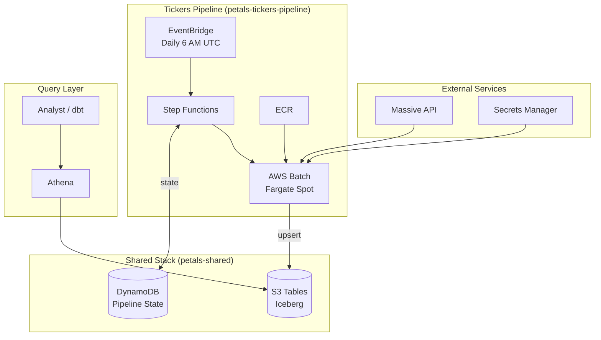

# Architecture

## Overview

Petals is a data platform for market data, built on AWS with infrastructure-as-code (CDK). The architecture prioritizes cost efficiency and operational simplicity.

## System Diagram

## Data Flow

**Pipeline (daily):**
EventBridge triggers Step Functions → reads last run time from DynamoDB → submits Batch job → container fetches from Massive API (incremental) → upserts to S3 Tables → records new timestamp

**Query:**
Athena queries S3 Tables via federated catalog (`s3tablescatalog`)
