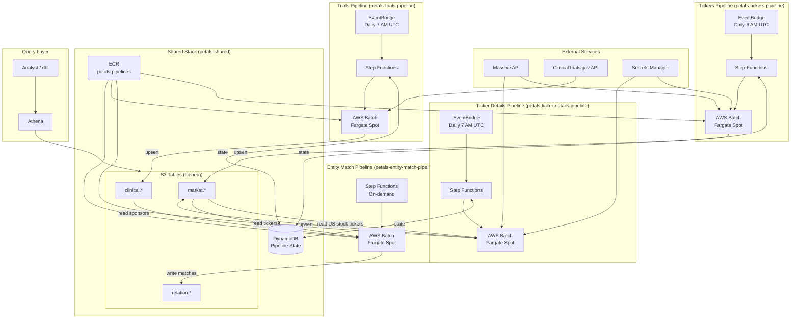

# Architecture

## Overview

Petals is a data platform for market data, built on AWS with infrastructure-as-code (CDK). The architecture prioritizes cost efficiency and operational simplicity.

## System Diagram

## Data Flow

### Tickers Pipeline (daily, 6 AM UTC)
EventBridge triggers Step Functions → reads last run time from DynamoDB → submits Batch job → container fetches from Massive API (incremental) → upserts to S3 Tables `market.tickers` → records new timestamp

### Ticker Details Pipeline (daily, 7 AM UTC)
EventBridge triggers Step Functions → reads last run time from DynamoDB → submits Batch job → reads US stock tickers from `market.tickers` (`market='stocks'`, `locale='us'`) → fetches detailed info from Massive API (SIC codes, descriptions, etc.) → upserts to S3 Tables `market.ticker_details` → records new timestamp

*Note: Initial backfill takes ~54 hours due to API rate limiting (5 calls/min). Incremental runs are much faster. Industry filtering (pharma/biotech via SIC codes) is done downstream.*

### Trials Pipeline (daily, 7 AM UTC)
EventBridge triggers Step Functions → reads last run time from DynamoDB → submits Batch job → container fetches COMPLETED studies from ClinicalTrials.gov (filtered to INDUSTRY sponsors) → upserts to S3 Tables `clinical.trials` → records new timestamp

### Entity Match Pipeline (on-demand)
Manual trigger → Step Functions submits Batch job → reads sponsors from `clinical.trials` and tickers from `market.ticker_details` → computes sentence-transformer embeddings → scores candidate pairs via cosine similarity → applies greedy 1:1 matching → writes matched pairs to `relation.sponsor_ticker_candidates`

*Note: Uses CPU-only embedding model (`all-MiniLM-L6-v2`), no GPU required. Full run completes in ~21 seconds.*

### Query
Athena queries S3 Tables via federated catalog (`s3tablescatalog`)

## Namespaces

| Namespace | Table | Description |
|-----------|-------|-------------|
| `market` | `tickers` | Stock/ETF ticker reference data from Massive API |
| `market` | `ticker_details` | Enriched ticker details (SIC codes, descriptions) for US stock tickers |
| `market` | `ticker_prices` | Daily OHLCV price data for tickers (yfinance + historical data) |
| `clinical` | `trials` | Completed clinical trials from ClinicalTrials.gov (INDUSTRY sponsors) |
| `relation` | `sponsor_ticker_candidates` | Sponsor↔ticker matches with confidence scores (embedding similarity) |

